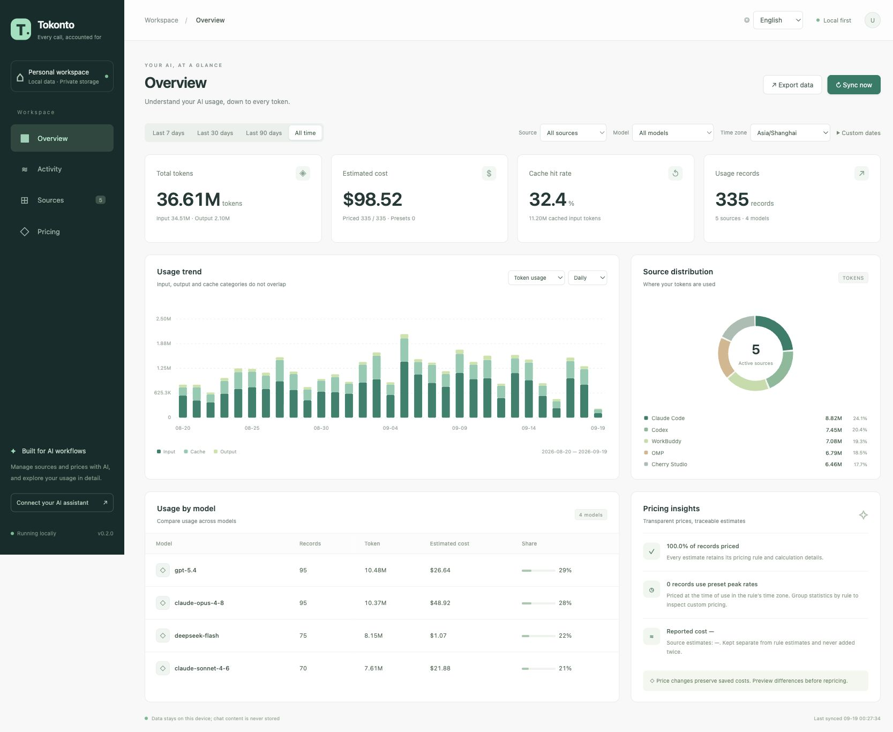
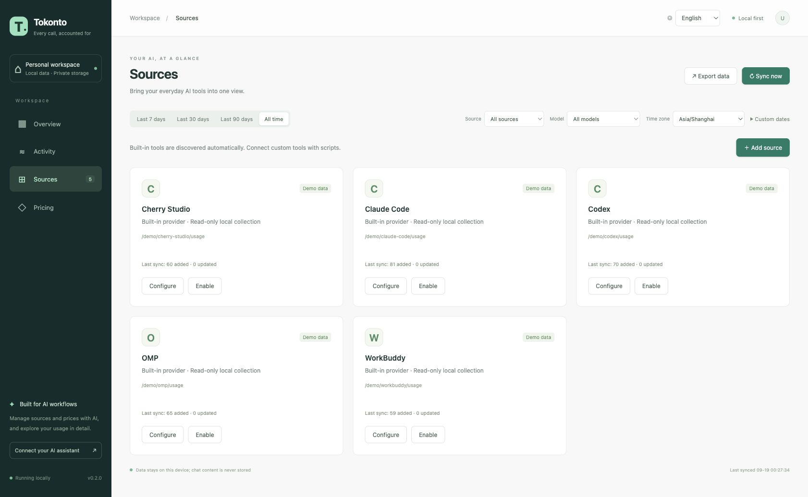
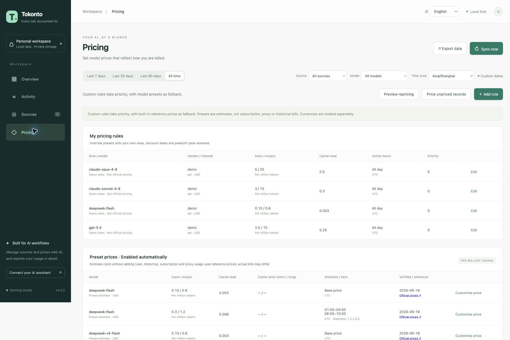

# Tokonto

[简体中文](README.md) | **English**

A local, AI-first dashboard for token usage and cost estimates. Read local session files or databases from AI applications without modifying them, aggregate token usage, and estimate costs using model, date and time-window rules. Extend the available sources with provider scripts written in any language.

## Screenshots

These screenshots use demo data and example paths to show the English interface. Usage and prices are illustrative.

**Overview**: explore token usage, cost trends, cache hit rates, and breakdowns by source and model.



<details>
<summary>View sources and pricing screenshots</summary>

**Sources**: manage built-in tools and script providers, and check their sync status.



**Pricing**: manage model prices, configure dates, time windows and cache rates, and browse built-in presets.



</details>

## The name

**Tokonto** combines **Token** and the German word **Konto** (account): `Tok` from Token followed by `onto` from Konto. Think of it as your **AI usage ledger**: one place to account for tokens across applications, calculate costs by model and time, and trace every estimate.

The project is **Tokonto**; the package and command are **`tokonto`**.

## Install from npm

Install **Bun ≥ 1.3.14** first ([Bun installation](https://bun.sh/docs/installation)) and make sure it is on your PATH:

```sh
bun install --global tokonto
tokonto --version
tokonto server --open
```

You can also install with `npm install --global tokonto`. Bun is still required at runtime; Node.js alone cannot run Tokonto. The npm package includes the built CLI, dashboard and Skill, without install-time compilation or runtime downloads. Upgrade with `bun install --global tokonto@latest` or `npm install --global tokonto@latest`.

Maintainers can find the OIDC publishing setup in the [npm CI guide (Chinese)](docs/npm-ci.md). Publishing a GitHub Release triggers the npm workflow; no long-lived npm token is required.

## Install from a GitHub Release

Requires **Bun ≥ 1.3.14**. Download `tokonto-0.2.0.tar.gz` and `SHA256SUMS` from [Releases](https://github.com/CaiJingLong/tokonto/releases) into the same directory:

```sh
shasum -a 256 -c SHA256SUMS  # On Linux: sha256sum -c SHA256SUMS
tar -xzf tokonto-0.2.0.tar.gz
cd tokonto-0.2.0
bun cli.js --version
bun cli.js server --open
```

No project dependencies need to be installed. The archive contains the CLI, dashboard, Skill and documentation; it is not a standalone native executable. Run `bun link` to expose `tokonto`, or use `bun /installation/path/cli.js` in place of the commands below. Bun's binary directory must be on PATH.

## Run from source

Requires **Bun ≥ 1.3.14**:

```sh
bun install --frozen-lockfile
bun run cli -- init
bun run cli -- server --open
```

The server opens **http://127.0.0.1:4318**, collects usage on startup and syncs every 60 seconds. Use `--interval 0` to disable automatic collection, `--port 4320` to choose a port, and `Ctrl+C` to stop. If Bun is not on PATH, use `~/.bun/bin/bun`.

The examples below use `tokonto`. During development, run `bun run build` and `bun link`, or substitute `bun run cli --` throughout.

The default database is `~/.tokonto/usage.sqlite`. All commands accept `--data-dir /path/to/data` or the `TOKONTO_HOME` environment variable. Built-in providers are initialized once. Bundled presets never overwrite user configuration or saved costs.

When upgrading from the old `token-usage` name, an existing `~/.token-usage/usage.sqlite` is reused if the new directory has no ledger. Data is not moved or copied. Path precedence is `--data-dir` → `TOKONTO_HOME` → legacy `TOKEN_USAGE_HOME` → existing new ledger → existing old ledger → new `~/.tokonto`. Run `tokonto doctor --json` to see the actual directory.

## Dashboard and languages

Select **中文** or **English** in the top bar. Your choice is saved in this browser. On the first visit, Tokonto follows the first supported browser language, with English as the fallback. Chinese browser locales use Simplified Chinese. If browser storage is unavailable, the selection still works for the current page.

Switching languages updates navigation, filters, charts, tables, dialogs and operation messages without refetching statistics or resetting filters. Time zone and currency choices remain independent of language. Model identifiers, user-defined names, CLI/API fields, CSV headers and original technical diagnostics retain their original values.

- Total tokens, estimated costs, cache hit rate and usage record counts.
- Hourly, daily and monthly trends; source, model, date and time-zone filters.
- Source distribution, model rankings, individual records and pricing explanations.
- Provider and pricing forms, discount dates, weekdays and overnight windows.
- Historical repricing previews, per-record pricing history and CSV export.

The dashboard reads statistics and paginated activity together through `usage dashboard`. Changing dates cancels older requests and hides stale results while loading. Custom dates and time zones persist in the URL. An automatically maintained index and bounded cache keep queries fast; imports, revisions and repricing invalidate them. Index upgrades do not change saved usage or costs.

An empty ledger shows empty states, never synthetic data. A usage record may represent one API call or an aggregate turn supplied by a tool, so record counts are not necessarily billable request counts.

## Built-in providers

| Source | Discovery path | Support and limitations |
| --- | --- | --- |
| Codex | `~/.codex/sessions`, `archived_sessions` | Prefers last-request usage, otherwise safely differences cumulative totals. Separates cached input, deduplicates snapshots, and does not count reasoning output twice. Inconsistent counts produce diagnostics. |
| Claude Code | `~/.claude/projects` | Reads assistant usage, deduplicates by API message ID, protects complete usage from partial copies, and separates short/long cache writes. |
| OMP / Oh My Pi | `~/.omp/agent/sessions` | Reads assistant message usage recursively, prefers response IDs for deduplication, and keeps source costs as source estimates. |
| WorkBuddy | `~/.workbuddy/traces` | Reads `trace.modelInfo` aggregates without inventing multi-model splits. Uses trace start time; exact time-window allocation cannot be reconstructed. |
| Cherry Studio | App data directory: `Data/cherrystudio.sqlite` | Reads `ai_usage_record` read-only; also accepts JSON/JSONL message exports at configured paths. Legacy IndexedDB, ZIP backups and incompatible databases are not guessed. |

Adapters have been checked against local real logs/databases, but upstream formats can change. Missing, inconsistent or unreadable records produce diagnostics. A missing directory appears as “No data found”; one provider failing does not stop others.

Built-in providers only read local session files or databases to extract and aggregate usage; they do not modify the original application's data. Tokonto stores allowlisted usage metadata in its own local ledger, without saving chat content, API keys or raw logs. Data access by custom script providers depends on the script implementation.

```sh
tokonto doctor --json
tokonto providers list --json
tokonto sync --id omp --json
tokonto sync --force --json
```

Use `providers put --input @provider.json` with a complete `{ "provider": { ... } }` object to update a source. Change paths or `vendor` / `channel` on the existing configuration; omit the read-only `status` field. `providers remove` deletes configuration but retains imported usage.

## Model prices and time-based billing

Prices match **vendor + model + channel + event time**. An application such as OMP is distinct from a model vendor such as DeepSeek and from a billing channel such as the official API, a proxy or a subscription. Uncertain channels default to `unknown`; override the provider channel or add a channel-specific rule when known.

**Custom rules take priority; unmatched usage automatically falls back to model presets.** The bundled, limited official price snapshot was verified on **2026-09-18**, covering selected OpenAI, Claude and GLM models and DeepSeek peak/off-peak rates. Each preset includes its official reference and verification date. View presets in Pricing or select “Customize price” to override rates and time windows.

Presets apply current standard API reference prices to historical, unknown-channel and subscription usage. They are estimates, not historical prices or final bills. Unknown models, incomplete usage or missing category rates remain unpriced. A matched custom rule with missing rates or conflicts is never bypassed. See the [pricing reference (Chinese)](docs/pricing.md).

Calculations use decimal strings. Rates are **per million tokens**. `input` excludes cached input; `output` already includes reasoning; `cacheRead`, `cacheWrite` and `cacheWriteLong` are charged separately. A used category without a rate makes the record unpriced, never free.

- `effectiveFrom` / `effectiveTo`: absolute validity timestamps with time zones.
- `dateFrom` / `dateTo`: dates in the rule's time zone.
- `timezone`: IANA time zone such as `Asia/Shanghai`.
- `weekdays`: 1–7, Monday–Sunday; omitted means every day.
- `windows`: daily windows, including overnight ranges such as `22:00 → 02:00`.
- `priority`: higher wins. Discount rules override rather than multiply automatically.
- `tiers`: selects a rate for the entire request by context threshold, not progressive marginal tiers. Uses `contextTokens` when available, otherwise the sum of input categories.

All time ranges **include their start and exclude their end**. The starting day determines the weekday and date for overnight windows. Daylight saving follows the selected IANA zone. Potential overlaps at equal priority are rejected; cross-time-zone conflict checks are conservative. Different priorities express explicit overrides.

```sh
# Base rates and half-price overnight windows for one example week
tokonto prices put --input @examples/prices.json --dry-run --json
tokonto prices put --input @examples/prices.json --json

# Rule revisions, one record's explanation and its pricing history
tokonto prices list --history --json
tokonto prices explain --source omp --id '<event-id>' --json
tokonto prices history --source omp --id '<event-id>' --json

# Preview first; apply explicitly
tokonto prices reprice --input '{"query":{"source":"omp"}}' --json
tokonto prices reprice --input '{"query":{"source":"omp"},"apply":true}' --json

# Price only unpriced records, retaining saved costs
tokonto prices fill --json
tokonto prices fill --apply --json
```

Price updates and removal preserve earlier versions. Saved costs do not change automatically; revisions to an existing usage ID reuse its original price snapshot. Repricing retains before/after usage and pricing with an audit operation ID. After changing a provider channel, use `sync --force` to refresh metadata, then explicitly reprice.

`costs` contains Tokonto's rule estimates, `reportedCosts` contains explicitly reported source costs, and `sourceEstimates` contains the source tool's estimates. Currencies are totaled separately without conversion. Token estimates do not represent subscriptions, credits or final bills; non-token image, audio and search charges are not calculated.

## Script providers

Use any language and exchange versioned JSON through stdin/stdout, without depending on internal code. Output is validated and imported atomically after the process exits. Repeated IDs update rather than accumulate. Plugins are **trusted local code** running as your user, not sandboxed programs.

See the [provider protocol (Chinese)](docs/providers.md), the runnable [provider.mjs](examples/provider.mjs) and sample [agent.jsonl](examples/agent.jsonl).

Create `provider.json` with absolute paths for your machine:

```json
{
  "provider": {
    "id": "my-agent",
    "name": "My Agent",
    "kind": "script",
    "command": ["/absolute/path/to/bun", "/absolute/tokonto/examples/provider.mjs", "/absolute/tokonto/examples/agent.jsonl"]
  }
}
```

```sh
tokonto providers put --input @provider.json --json
tokonto providers test --id my-agent --json
tokonto sync --id my-agent --json
tokonto sync --id my-agent --json  # Does not count the same records twice
```

## AI-first: Skill + CLI

The bundled Skill is [.agents/skills/tokonto/SKILL.md](.agents/skills/tokonto/SKILL.md). Load it from the project or install it into a personal skills directory:

```sh
tokonto skill install --target ~/.codex/skills --json
tokonto skill install --target ~/.omp/agent/skills --json
```

Installation refuses to overwrite an existing directory and does not link the CLI. Ensure `tokonto` is available or let the assistant use `bun /installation/path/cli.js` (or `bun run cli --` from source). You can ask the assistant in Chinese or English; machine command names and JSON keys remain stable.

Agents should discover commands and their schemas first:

```sh
tokonto --version --json
tokonto schema --json
tokonto schema --command 'prices put' --json
tokonto usage stats --input '{"source":"omp","from":"2026-09-01T00:00:00+08:00","to":"2026-10-01T00:00:00+08:00","timezone":"Asia/Shanghai","groupBy":"hour"}' --json
```

Commands are non-interactive. Complex input supports `--input '{...}'`, `--input @file.json` or `--input -` (stdin). With `--json`, stdout contains only `{ok,data}` or `{ok:false,error}`; logs use stderr. Exit codes: 0 success, 1 input/execution error, 2 partial sync failure (successful sources are saved; inspect `results`). `dryRun` does not execute provider scripts; `providers test` executes scripts without importing records.

Other commands include `usage list`, `usage export`, `audit list`, `prices validate` and `prices remove`. Consult `schema` for exact parameters. CSV export returns `data.content`; the dashboard downloads it directly. Machine-oriented JSON, CSV and diagnostics are not translated.

## Development and verification

```sh
bun test
bun run typecheck
bun run build
bun dist/cli.js server --interval 0
```

`dist/` contains the bundled CLI, static dashboard and Skill. The stack uses TypeScript, Bun HTTP/SQLite, Zod, Decimal.js and Luxon. No external CDN is needed. UI translations live in `web/messages.ts`; see [the bilingual localization guide](docs/localization.md) before adding UI text.

Build and smoke-test GitHub archives with `bun run release:pack` and `bun run release:smoke`; for npm use `bun run npm:pack` and `bun run npm:smoke`. GitHub Actions runs checks on macOS and Linux. Verified version tags create draft Releases with bilingual notes. Publishing the draft triggers npm via OIDC. See [release instructions (Chinese)](docs/releasing.md) and [the changelog](CHANGELOG.md).

Key directories: `src/pricing.ts` (billing), `src/store.ts` (data/audit), `src/providers/` (adapters), `src/commands.ts` (shared commands/schema), `src/cli.ts`, `src/server.ts` and `web/`.

For reproducible UI testing, generate synthetic data in an isolated directory:

```sh
bun scripts/demo.ts /tmp/tokonto-demo
bun run cli -- server --data-dir /tmp/tokonto-demo --port 4320 --interval 0
```

The demo disables real providers and refuses to mix with existing real usage. Never run it against your daily ledger. Local macOS files, plugin process groups and the Edge dashboard have been checked. CI covers Linux and macOS; real third-party paths on Windows/Linux still need platform-specific validation. Windows script-tree cleanup uses `taskkill`.

## Upgrades, backups and removal

Run `tokonto doctor --json` to locate your data. Stop the server and every CLI using the ledger, then copy the entire data directory, including any SQLite WAL files, to a safe place. New installations use `~/.tokonto`; older ones may use `~/.token-usage`. Do not copy only `usage.sqlite` while writes are active.

Extract a new release to a new directory and use the same data directory. Existing configuration is retained, and preset updates do not silently reprice saved costs. Creating a statistics index may initially take extra time and disk space. To roll back, stop the server, restore the complete pre-upgrade backup, then run the older version.

To uninstall, stop the server and run `npm uninstall --global tokonto` or `bun remove --global tokonto`. If you used `bun link`, run `bun unlink` from that installation before deleting it. Ledgers and separately installed Skills remain; back up or remove them separately as needed.

## License

[MIT](LICENSE). Distributed `THIRD_PARTY_NOTICES.md` includes bundled dependency licenses. See [contributing (Chinese)](CONTRIBUTING.md) and [security (Chinese)](SECURITY.md).
