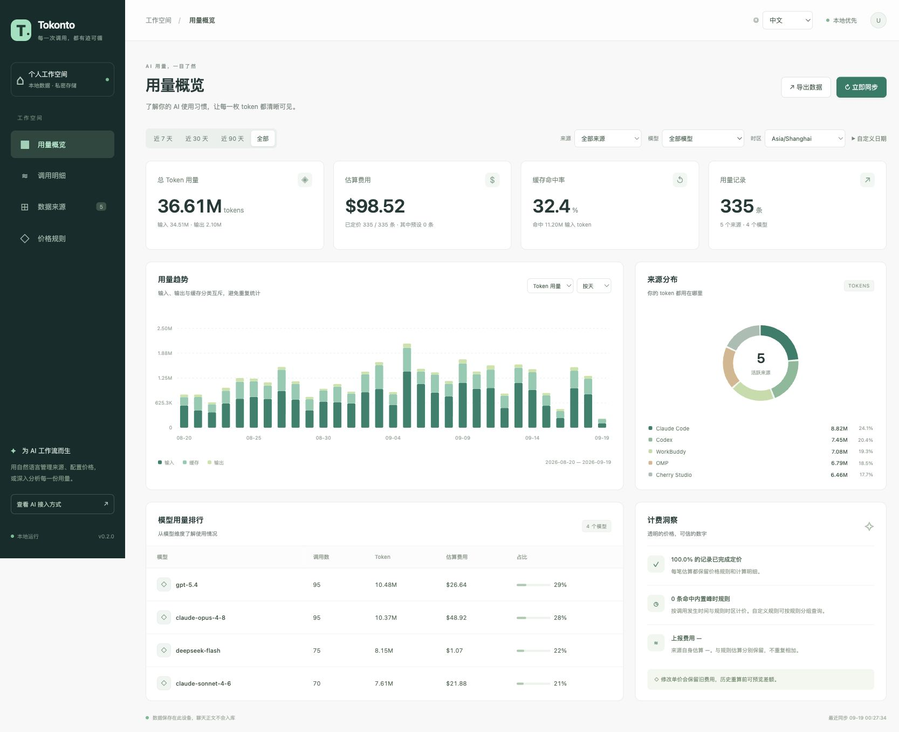
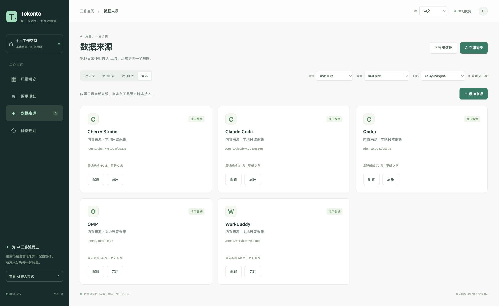
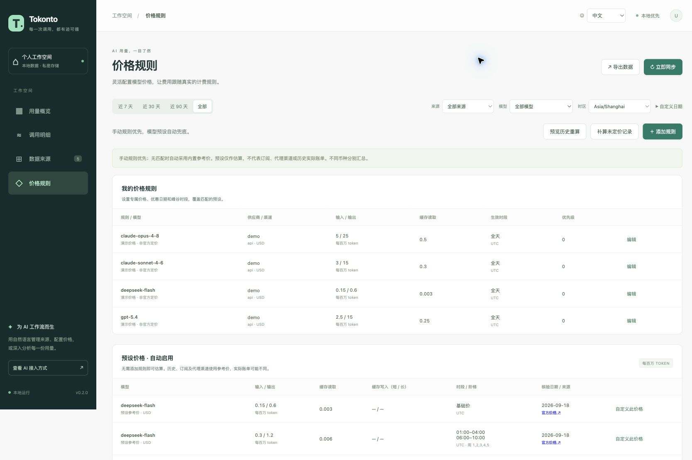

# Tokonto

**简体中文** | [English](README.en.md)

本地运行、AI 优先的 token 用量与计费仪表盘。以只读方式读取各 AI 应用保存在本机的会话文件或数据库，汇总 token 用量，并按模型、日期和时段规则估算费用。支持用任意语言编写 Provider 脚本扩展来源。

## 项目截图

以下截图使用演示数据与示例路径，展示中文界面；用量和价格仅用于演示。

**用量概览**：查看 token 用量、费用趋势、缓存命中率，以及不同来源和模型的占比。



<details>
<summary>查看数据来源与计费规则截图</summary>

**数据来源**：集中管理内置工具和脚本 Provider，查看同步状态。



**计费规则**：管理模型价格，配置日期、时段和缓存费率，并查看内置预设。



</details>

## 名字的由来

**Tokonto** 的命名灵感来自 **Token** 与德语 **Konto**（账户）的组合：取 Token 的 `Tok`，接上 Konto 的 `onto`，组成 Tokonto。它表达的是一本属于你的 **AI 用量账本**：把不同应用的 token 消耗汇集起来，按模型、日期和时段算清费用，让每一笔估算都能追溯。

项目名写作 **Tokonto**，包名与命令名使用小写 **`tokonto`**。

## 从 npm 安装

需要先安装 **Bun ≥ 1.3.14**（[安装 Bun](https://bun.sh/docs/installation)），并将 Bun 加入 PATH。推荐：

```sh
bun install --global tokonto
tokonto --version
tokonto server --open
```

也可以使用 `npm install --global tokonto` 安装，运行时仍需要 Bun；仅有 Node.js 无法运行本工具。npm 包已包含编译后的 CLI、Dashboard 和 Skill，安装时不编译、不下载额外运行时。升级使用 `bun install --global tokonto@latest` 或 `npm install --global tokonto@latest`。

维护者配置自动发布请参考 [npm CI 指南](docs/npm-ci.md)。

## 从 GitHub Release 安装

需要 **Bun ≥ 1.3.14**（[安装 Bun](https://bun.sh/docs/installation)）。从仓库 Releases 下载 `tokonto-0.2.0.tar.gz` 和 `SHA256SUMS`，放在同一目录：

```sh
shasum -a 256 -c SHA256SUMS  # Linux 可用 sha256sum -c SHA256SUMS
tar -xzf tokonto-0.2.0.tar.gz
cd tokonto-0.2.0
bun cli.js --version
bun cli.js server --open
```

无需安装项目依赖。发行包包含 CLI、Dashboard、Skill 和使用文档，运行仍需 Bun。使用 `bun link` 后可调用 `tokonto`；未链接时用 `bun /安装目录/cli.js` 代替本文中的命令。Bun 的 bin 目录需在 PATH 中。

## 从源码启动

需要 **Bun ≥ 1.3.14**。在项目目录运行：

```sh
bun install --frozen-lockfile
bun run cli -- init
bun run cli -- server --open
```

默认打开 **http://127.0.0.1:4318**，启动后自动采集，每 60 秒再次同步。使用 `--interval 0` 禁用自动采集，`--port 4320` 更换端口。`Ctrl+C` 停止。

本机 Bun 不在 PATH 时：

```sh
~/.bun/bin/bun install --frozen-lockfile
~/.bun/bin/bun run cli -- server --open
```

本文后续用 `tokonto` 表示 CLI。源码开发时先运行 `bun run build`，再通过 `bun link` 链接命令；也可以始终用 `bun run cli --` 代替。数据库默认位于 `~/.tokonto/usage.sqlite`；所有命令均支持 `--data-dir /path/to/data` 或环境变量 `TOKONTO_HOME`。默认来源只初始化一次；预设价格随程序提供，不会覆盖用户配置和已存费用。

从旧名 `token-usage` 升级时，若新目录尚无账本，会继续使用 `~/.token-usage/usage.sqlite`，不移动或复制数据。路径优先级为 `--data-dir` → `TOKONTO_HOME` → 兼容变量 `TOKEN_USAGE_HOME` → 已有的新目录账本 → 已有的旧目录账本 → 新建 `~/.tokonto`。用 `tokonto doctor --json` 查看实际数据目录。

## Dashboard

右上角可切换 **中文 / English**，浏览器会记住选择。首次访问跟随浏览器的首个受支持语言，其他语言回退为英文；中文地区语言统一显示简体中文。存储被禁用时仍可在当前页面切换。语言切换不会重置筛选、时区、币种或重新请求统计。模型标识、用户自定义名称、CLI/API 字段、CSV 表头及原始技术诊断保持原值。

后续维护同时更新中英文 README 和双语 Release；新增界面文案进入 `web/messages.ts`，见[本地化指南](docs/localization.md)。

- 总 token、费用估算、缓存命中率、用量记录数。
- 按小时、日、月查看趋势，按来源、模型、日期和时区筛选。
- 来源分布、模型排行、调用明细与计费解释。
- 添加/编辑来源、模型价格、优惠日期、星期和跨午夜时段。
- 历史重算预览、逐条计费历史、CSV 导出。

看板通过 `usage dashboard` 一次读取同一筛选下的各维度统计与分页明细。切换日期时会取消旧请求，加载中不显示旧范围的结果；自定义日期与时区保存在 URL 中。统计使用自动维护的轻量索引和有容量限制的缓存，导入、修订或重算后自动更新；升级创建索引不会改写已有用量或费用。

真实记录为空时显示空状态，不自动混入示例数据。单条用量可能是一个 API 请求，也可能是工具提供的整轮聚合，因此记录数不承诺等同于账单请求数。

## 内置来源

| 来源 | 自动发现位置 | 支持与边界 |
| --- | --- | --- |
| Codex | `~/.codex/sessions`、`archived_sessions` | 优先使用单次 last usage，无单次值时安全计算累计差分；从总输入中拆出缓存读取；重复快照去重，reasoning 不重复计入 output；矛盾计数保留诊断 |
| Claude Code | `~/.claude/projects` | assistant usage，按 API message ID 去重；跨文件部分副本不能覆盖完整用量；区分短期/长期写缓存 |
| OMP / Oh My Pi | `~/.omp/agent/sessions` | assistant message usage，包含子目录；response ID 优先去重；来源 cost 保留为来源估算 |
| WorkBuddy | `~/.workbuddy/traces` | `trace.modelInfo` 汇总，模型不唯一时不强行分摊；以 trace 开始时间归属，无法精确还原跨时段调用 |
| Cherry Studio | 应用数据目录的 `Data/cherrystudio.sqlite` | 只读 `ai_usage_record`；也支持指定路径读取 JSON/JSONL 消息导出。旧版 IndexedDB、ZIP 备份和不兼容数据库不会自动猜测读取 |

这些适配器已在本机真实日志/数据库上验证，但第三方工具升级可能改变格式。源文件中矛盾、缺失或无法解析的记录会给诊断。目录不存在显示“未发现数据”；单个来源失败不阻断其他来源。

内置来源只读取本地会话文件或数据库，从中提取用量信息并汇总统计，不修改原应用的数据。Tokonto 将白名单内的用量元数据保存在自己的本地账本中，不保存聊天正文、API key 或原始日志。自定义脚本 Provider 的数据读取行为由脚本实现决定。

```sh
tokonto doctor --json
tokonto providers list --json
tokonto sync --id omp --json
tokonto sync --force --json
```

更新来源使用 `providers put --input @provider.json`，传入完整 `{ "provider": { ... } }`。在现有配置上修改路径或 `vendor` / `channel`，不要原样带入只读的 `status` 字段。`providers remove` 删除配置，已采集用量保留。

## 模型价格与分时计费

价格匹配维度为 **vendor + model + channel + 发生时间**。来源（如 OMP）不等于模型供应商（如 DeepSeek），供应商也不等于实际计费渠道（如官方 API、代理、订阅）。不能可靠判断时，来源渠道默认 `unknown`。确认实际渠道后可在来源配置中覆盖，或创建针对该渠道的规则。

**手动规则优先，没有匹配时自动使用模型预设价**。内置一份 **2026-09-18 核验的有限官方价格快照**，覆盖部分 OpenAI、Claude、GLM 模型与 DeepSeek 峰谷规则。Dashboard 可直接查看预设，或点击“自定义此价格”修改单价和日期时段。每条预设附官方链接与核验日期。

预设对历史、未知渠道和订阅来源提供当前标准 API 价格的参考估算，不代表当时实际价格或最终账单。未知模型、用量不完整或所需类别缺价仍显示未定价；手动规则已匹配但缺价或冲突时，不绕过该规则。详见[预设价格说明](docs/pricing.md)。

计价使用十进制字符串，避免二进制浮点累计误差。单价单位是**每百万 token**；`input` 不含缓存，`output` 已含 reasoning，`cacheRead`、`cacheWrite`、`cacheWriteLong` 分别计费。一个有用量的类别缺价时，该记录明确为未定价，绝不按 0 元算。

- `effectiveFrom` / `effectiveTo`：含时区的绝对有效期。
- `dateFrom` / `dateTo`：规则时区内的日期范围。
- `timezone`：IANA 时区，如 `Asia/Shanghai`。
- `weekdays`：1 到 7，周一到周日；省略为每天。
- `windows`：多个每日时段，支持 `22:00 → 02:00` 跨午夜。
- `priority`：数值较大优先；优惠通过高优先级规则覆盖，不自动叠乘。
- `tiers`：按单次请求上下文 token 阈值选取整次请求单价；不是按阶梯分段累进。若有 `contextTokens` 用它判定，否则使用全部输入类别之和。

所有时间范围**左闭右开**。跨午夜以**开始日**决定星期和本地日期；夏令时按指定 IANA 时区转换。同优先级潜在重叠会报错，异时区规则采取保守冲突校验，设置不同优先级可明确覆盖关系。

```sh
# 示例含基准价格与指定一周的凌晨半价
tokonto prices put --input @examples/prices.json --dry-run --json
tokonto prices put --input @examples/prices.json --json

# 规则历史、单条费用解释与全部修订历史
tokonto prices list --history --json
tokonto prices explain --source omp --id '<event-id>' --json
tokonto prices history --source omp --id '<event-id>' --json

# 重算默认只预览；应用时增加 apply=true
tokonto prices reprice --input '{"query":{"source":"omp"}}' --json
tokonto prices reprice --input '{"query":{"source":"omp"},"apply":true}' --json

# 只补算未定价记录，保留已有费用；默认预览
tokonto prices fill --json
tokonto prices fill --apply --json
```

价格更新和停用会保留旧版本。已存费用不随价格变化；同 ID 的用量修订采用原价格快照。重算时完整保留每条变更前后的用量与价格，关联操作 ID。改变来源渠道之后，需要 `sync --force` 更新元数据，再显式重算才能使用新规则。

费用输出分开呈现：`costs` 是本工具规则估算，`reportedCosts` 是来源明确上报的费用，`sourceEstimates` 是来源自己的估算。不同币种分别汇总，没有自动换汇，也不把 token 估价当作订阅、积分或最终账单。图片、音频、搜索等非 token 收费不在第一版计算范围内。

## 脚本 Provider

脚本可以用任何语言，通过 stdin / stdout 交换版本化 JSON，无须依赖项目内部代码。进程退出后统一校验和原子入库；重复 ID 更新而不累加。插件是以当前用户权限执行的**可信本地代码**，不是沙箱。

完整协议见 [Provider 文档](docs/providers.md)。可直接运行的示例为 [provider.mjs](examples/provider.mjs) 和 [agent.jsonl](examples/agent.jsonl)。

例如在 `provider.json` 写入（路径改为你本机的绝对路径）：

```json
{
  "provider": {
    "id": "my-agent",
    "name": "My Agent",
    "kind": "script",
    "command": ["/absolute/path/to/bun", "/absolute/tokonto/examples/provider.mjs", "/absolute/tokonto/examples/agent.jsonl"]
  }
}
```

```sh
tokonto providers put --input @provider.json --json
tokonto providers test --id my-agent --json
tokonto sync --id my-agent --json
tokonto sync --id my-agent --json  # 第二次不会重复累计
```

## AI 优先：Skill + CLI

项目 Skill 位于 [.agents/skills/tokonto/SKILL.md](.agents/skills/tokonto/SKILL.md)。它可以随项目加载，也可以安装到工具的个人技能目录：

```sh
tokonto skill install --target ~/.codex/skills --json
tokonto skill install --target ~/.omp/agent/skills --json
```

已有目录时拒绝覆盖。安装本身不会链接 CLI，仍需要 `bun link`，或让 AI 使用 `bun /安装目录/cli.js`；源码开发则使用 `bun run cli --`。

AI 首先调用命令发现，然后按实际 Schema 使用功能：

```sh
tokonto --version --json
tokonto schema --json
tokonto schema --command 'prices put' --json
tokonto usage stats --input '{"source":"omp","from":"2026-09-01T00:00:00+08:00","to":"2026-10-01T00:00:00+08:00","timezone":"Asia/Shanghai","groupBy":"hour"}' --json
```

全部命令无须交互，复杂输入支持 `--input '{...}'`、`--input @file.json` 和 `--input -`（stdin）。`--json` 的 stdout 只有 `{ok,data}` 或 `{ok:false,error}`；日志在 stderr。退出码：0 成功，1 输入/执行错误，2 同步部分失败（成功来源已保存，查看 `results`）。`dryRun` 不执行来源脚本；`providers test` 会真实执行脚本但不导入。

还可以使用 `usage list`、`usage export`、`audit list`、`prices validate`、`prices remove` 等；完整参数以 `schema` 输出为准。CSV 导出返回 `data.content`，便于 AI 决定文件保存位置；dashboard 导出按钮会直接下载。

## 开发与验证

```sh
bun test
bun run typecheck
bun run build
bun dist/cli.js server --interval 0
```

构建产物 `dist/` 包含 CLI、dashboard 静态资源和 Skill，运行仍需要 Bun。采用 TypeScript、Bun HTTP/SQLite、Zod、Decimal.js、Luxon，前端无需外部 CDN。

发行包构建与独立安装检查：GitHub 归档使用 `bun run release:pack`、`bun run release:smoke`；npm 使用 `bun run npm:pack`、`bun run npm:smoke`。GitHub Actions 在 macOS、Linux 运行同样检查；版本 tag 通过验证后生成 Release 草稿。详见[发布文档](docs/releasing.md)和[更新记录](CHANGELOG.md)。

源码：`src/pricing.ts` 计费，`src/store.ts` 数据/审计，`src/providers/` 来源，`src/commands.ts` 统一功能注册与 Schema，`src/cli.ts` CLI，`src/server.ts` 服务，`web/` 仪表盘。

需要可复现的 UI 演示时，在隔离目录生成合成数据：

```sh
bun scripts/demo.ts /tmp/tokonto-demo
bun run cli -- server --data-dir /tmp/tokonto-demo --port 4320 --interval 0
```

演示脚本会停用该演示账本的真实来源，并拒绝混入已有真实数据。不要对日常账本使用演示脚本。

macOS 本地文件、插件进程组和 Edge 浏览器已验证。其他平台路径有默认适配，但 Windows/Linux 未做实机验收；Windows 的脚本树清理使用 taskkill。

## 升级、备份与卸载

升级前用 `tokonto doctor --json` 确认实际数据目录，停止 server 和所有访问账本的 CLI，再复制整个目录到安全位置，包括可能存在的 SQLite WAL 文件。新安装默认为 `~/.tokonto`，旧安装可能继续使用 `~/.token-usage`。不要在写入期间仅复制 `usage.sqlite`。

将新版本解压到新目录，使用同一数据目录启动；默认配置只初始化一次，已有费用不会因升级预设而自动重算。首次启动可能创建统计索引，大账本需要额外时间和磁盘空间。需要回退时先停止服务，恢复完整升级前备份，再启动旧版本。

卸载时停止服务。npm 安装可用 `npm uninstall --global tokonto`，Bun 安装可用 `bun remove --global tokonto`。若执行过 `bun link`，在对应安装目录执行 `bun unlink`，然后删除安装目录。账本和另行安装的 Skill 会保留，按需要单独备份或移除。

## 许可证

[MIT](LICENSE)。发行包的 `THIRD_PARTY_NOTICES.md` 包含所捆绑依赖的许可声明。参与开发见 [CONTRIBUTING.md](CONTRIBUTING.md)，安全说明见 [SECURITY.md](SECURITY.md)。
